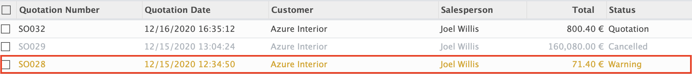
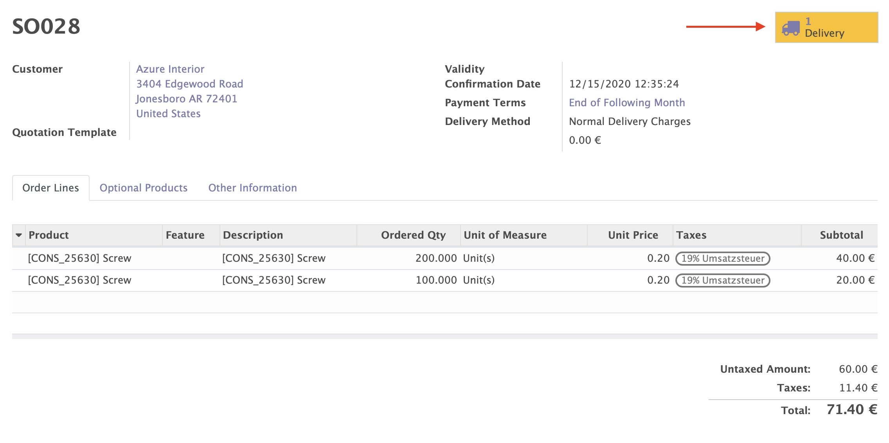

    <a href="https://www.odoo.com/documentation/12.0/index.html">
        </img>
    </a>
    <a href="http://www.alliantum.com">
        </img>
    </a>
    <a href="http://www.gnu.org/licenses/agpl-3.0-standalone.html">
        </img>
    </a>

    
    

        <h1>Warning State</h1>
        Visual clues to catch the attention of a salesman
        

    

## Usage

Install this add-on and it will be automatically ready to use.

When all the deliveries of a sales order have been cancelled, visual clues are added to be able
to know at a glance that its status is _warning_.

- When viewing all the quotations, the corresponding lines have a _warning_ background color.
    

        
    

- When viewing a specific quotation, the delivery count widget has a _warning_ background color.
    

        
    

## Contributors

- [Alliantum](http://www.alliantum.com)
